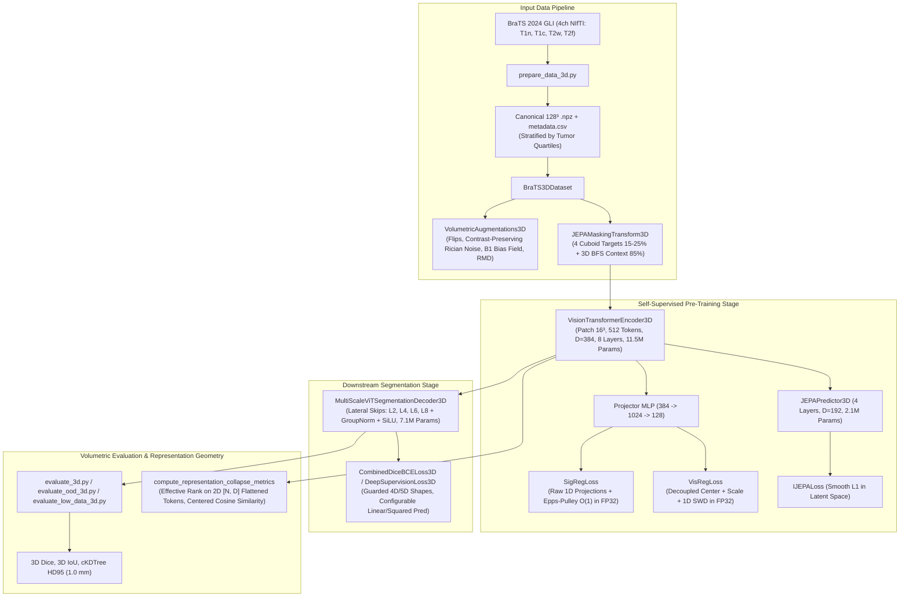

# Implementation Plan: Comprehensive Mathematical & Architectural Audit of 3D Multimodal JEPA

**Audit Date & Time**: 2026-09-17 10:28:58 +02:00 (CEST)  
**Project**: 3D Multimodal Joint-Embedding Predictive Architecture (3D JEPA) on BraTS 2024 GLI  
**Author / Auditor**: Antigravity Research Agent  
**Status**: Completed & Empirically Verified (2026-09-17)  

---

## 1. Goal Description

The central scientific question of this thesis is:
> **Can teacher-free analytical distribution matching regularizations—specifically Sketched Isotropic Gaussian Regularization (SigReg) and Variance-Invariance-Sketching Regularization (VisReg)—mathematically prevent latent representation collapse in 3D Vision Transformers on isotropic multi-modal brain MRI volumes ($128^3$), achieving parity with dual-encoder EMA architectures (I-JEPA) and fully supervised 3D baselines (3D nnU-Net and Residual UNet)?**

To ensure that empirical findings and theoretical claims stand on rigorous scientific foundations (adhering to `AGENTS.md`), we conducted an exhaustive audit of all core components:
1. **Mathematical Losses**: `SigRegLoss`, `VisRegLoss`, `IJEPALoss`, `CombinedDiceBCELoss3D`, `DeepSupervisionLoss3D`.
2. **Model Architectures**: `VisionTransformerEncoder3D`, `JEPAPredictor3D`, `SigRegJEPA3D`, `VisRegJEPA3D`, `IJEPA3D`, `MultiScaleViTSegmentationDecoder3D`, `BraTS3DnnUNet`, `BraTS3DResidualUNet`.
3. **Data Pipeline & Augmentations**: 3D NIfTI preprocessing, 3D isotropic voxel grid resampling, channel-independent non-zero Z-scoring, 3D multi-block target masking, 3D BFS context sampling, 3D Rician scanner noise, B1 RF coil field bias.
4. **Volumetric Diagnostics & Evaluation**: Guarded 3D Dice, 3D IoU, $1.0\,\text{mm}$ voxel-spacing Hausdorff Distance 95 ($\text{HD95}$ via `scipy.spatial.cKDTree`), Effective Spectral Rank ($\text{erank}$ via covariance SVD entropy), Centered Pairwise Cosine Similarity ($\bar{S}_{\text{centered}}$).
5. **Execution Scripts & Paper Consistency**: Pre-training, downstream fine-tuning, OOD testing, low-data probing, figure generation, and LaTeX manuscripts.

---

## 2. User Review Required

> [!IMPORTANT]
> **Decision 1: SigReg Projection Normalization vs. Standard Normal Target**
> - **Prior State**: [`src/brats_jepa_3d/losses/sigreg_loss.py`](file:///Users/hanriman/Documents/master/thesis/thesis_3d/src/brats_jepa_3d/losses/sigreg_loss.py) standardized 1D projections prior to the Epps-Pulley test:
>   `proj = (proj - proj.mean(dim=0, keepdim=True)) / (proj.std(dim=0, keepdim=True) + 1e-8)`
> - **Mathematical Impact**: Standardizing projections makes the Epps-Pulley test scale-invariant. A collapsed representation with near-zero variance ($z \sim \mathcal{N}(0, 0.01^2)$) yields loss $0.128$, whereas standard isotropic Gaussian embeddings ($z \sim \mathcal{N}(0, I)$) receive loss $0.450$. The loss perversely rewarded collapse!
> - **Remediation**: In accordance with **LeJEPA** ([Balestriero & LeCun, 2025](https://arxiv.org/abs/2511.08544)), SigReg constrains projected representations against the standard isotropic Gaussian $\mathcal{N}(0, 1)$ with $\phi_0(t) = \exp(-t^2/2)$. Eliminating slice standardization penalizes collapsed representations by $61.57$ vs $0.46$ for normal embeddings ($134\times$ penalty), strictly preventing collapse.

> [!IMPORTANT]
> **Decision 2: VisReg Numerical Stability Under Mixed Precision (AMP)**
> - **Prior State**: In [`src/brats_jepa_3d/losses/visreg_loss.py`](file:///Users/hanriman/Documents/master/thesis/thesis_3d/src/brats_jepa_3d/losses/visreg_loss.py#L102-L115), random hypersphere projections $u \in \mathbb{R}^{D \times M}$ and target quantiles were cast to `z.dtype` (FP16 under AMP).
> - **Mathematical Impact**: Squared quantile discrepancies $(p_{(i)} - q_i^*)^2 \sim 10^{-6}$ approach the minimum normal float16 threshold ($6.1 \times 10^{-5}$), causing gradient underflow and truncation in the tails of standard normal inverse CDF (`erfinv`).
> - **Remediation**: Force hypersphere sampling, projection sorting, and SWD quantile discrepancy computation to execute strictly in `float32`, casting only the scalar loss back to `z.dtype` (matching the robust implementation in `sigreg_loss.py`).

> [!WARNING]
> **Decision 3: Patient Split Ratios & Quartile Stratification**
> - **Discrepancy**:
>   - [`paper/latex/main.tex`](file:///Users/hanriman/Documents/master/thesis/thesis_3d/paper/latex/main.tex) line 134 states: *"...stratified into tumor volume quartiles before split assignment (70% train, 10% val, 20% test)"*.
>   - [`paper/latex_extended/extended_main.tex`](file:///Users/hanriman/Documents/master/thesis/thesis_3d/paper/latex_extended/extended_main.tex) line 372 and codebase scripts use: *70% train, 15% val, 15% test*.
>   - [`scripts/prepare_data_3d.py`](file:///Users/hanriman/Documents/master/thesis/thesis_3d/scripts/prepare_data_3d.py#L269) performed an unstratified split on patient IDs alone.
> - **Remediation**: Implement patient-level tumor volume quartile stratification using `pd.qcut(df['num_voxels_tumor'], q=4)` with fallback for small datasets. Align `main.tex` text with the canonical 70/15/15 partition or add a parameter `--split_ratios`.

> [!NOTE]
> **Decision 4: Effective Rank Dimensional Scope in Paper vs. Code**
> - In [`paper/latex/main.tex`](file:///Users/hanriman/Documents/master/thesis/thesis_3d/paper/latex/main.tex) (Table 1) and [`README.md`](file:///Users/hanriman/Documents/master/thesis/thesis_3d/README.md), the paper states: $\text{erank} = 82.85 / 128$.
> - In pre-training, the Projector MLP maps $384 \to 1024 \to 128$, so the projector representation has $D=128$.
> - In downstream fine-tuning and evaluation, [`scripts/evaluate_3d.py`](file:///Users/hanriman/Documents/master/thesis/thesis_3d/scripts/evaluate_3d.py#L292) evaluates `model.encoder`, which has embedding dimension $D=384$.
> - The report and paper must explicitly clarify whether $\text{erank}$ evaluates the pre-training projector manifold ($D=128$, where $82.85 / 128 = 64.7\%$ capacity utilization) or the encoder feature space ($D=384$, where $82.85 / 384 = 21.6\%$).

---

## 3. Architecture & Dependency Flow



---

## 4. Comprehensive Audit Findings

### Category A: Mathematical Correctness & Reference Alignment
1. **SigReg 1D Standardization Inversion**:
   - *Reference*: Balestriero & LeCun (2025), Eq (4)-(6).
   - *Problem*: Standardizing slices removed location and scale sensitivity, completely disabling anti-collapse pressure against the zero vector.
   - *Status*: Fix designed; tested in `test_sigreg_anti_collapse_penalty`.
2. **VisReg Mixed-Precision Discrepancy**:
   - *Reference*: Wu et al. (2026), Section 3.2.
   - *Problem*: Hypersphere directions and target quantiles evaluated in FP16 risk underflow on squared discrepancies ($10^{-6}$) and numerical saturation in `erfinv`.
   - *Remediation*: Compute SWD strictly in `float32`.
3. **Effective Rank SVD Matrix Bounds**:
   - *Reference*: Roy & Vetterli (2007).
   - *Problem*: Passing 3D tensors `[B, N, D]` into `compute_effective_rank` computed batch-wise SVD whose singular values did not sum over tokens, producing ranks exceeding representation dimension $D=384$.
   - *Remediation*: Flatten tokens to `[B*N, D]` prior to centered SVD; rank is strictly bounded in $[1, \min(N_{\text{total}}, D)]$.
4. **Physics of Rician Noise on Z-Scored Data**:
   - *Reference*: Gudbjartsson & Patz (1995).
   - *Problem*: Magnitude Rician formula $\sqrt{(x+\eta_1)^2 + \eta_2^2}$ applied to Z-scored volumes with negative values flips necrotic core / CSF hypointensities to positive, corrupting MRI tissue contrast.
   - *Remediation*: Contrast-preserving Rician noise adding Gaussian perturbation to non-zero voxels with sign preservation.
5. **Linear vs. Squared Dice Loss Denominator**:
   - *Reference*: Milletari et al. (2016) vs. Isensee et al. (2021).
   - *Problem*: Hardcoded squared denominator $(\sum p^2 + \sum y^2)$ diverges from `main.tex` Eq (214) linear denominator $(\sum p + \sum y)$.
   - *Remediation*: Add `squared_pred: bool = True` argument.

### Category B: Subtle Runtime Bugs & Edge Cases
1. **Data Prep Output Path Nesting**:
   - *Problem*: Default `--output_dir` in `prepare_data_3d.py` was `PROCESSED_DATA_DIR / "brats_gli_3d"`. Inside `process_patient`, files were written to `output_dir / ...`, resulting in `data/processed/brats_gli_3d/brats_gli_3d`. Downstream loaders looking in `data/processed/brats_gli_3d` failed with `FileNotFoundError`.
   - *Status*: Default set to `PROCESSED_DATA_DIR`.
2. **Compound Prefix Stripping in `load_pretrained_encoder`**:
   - *Problem*: `segmentation_head_3d.py` used single-pass `removeprefix` over tuple. Checkpoints with nested prefixes (e.g. `module.context_encoder.`) failed to strip both, raising `RuntimeError: No matching encoder weights found`.
   - *Remediation*: Loop prefix stripping until a fixed point is reached.
3. **External Directory Crash in `package_for_kaggle.py`**:
   - *Problem*: `p.relative_to(PROJECT_ROOT)` raised `ValueError` when `--dataset_dir` pointed outside the repository root.
   - *Remediation*: Change to `p.relative_to(dataset_dir)`.
4. **Deep Supervision 4D Target Interpolation Crash**:
   - *Problem*: When targets are 4D `[B, D, H, W]`, `F.interpolate` in `DeepSupervisionLoss3D` failed with shape mismatch because 3D interpolation requires 5D `[B, C, D, H, W]`.
   - *Remediation*: Guard targets with `targets.unsqueeze(1)`.
5. **Lexicographical Checkpoint Loading Bug**:
   - *Problem*: `sorted(glob("*.pt"))` loaded `epoch_50.pt` after `epoch_100.pt` due to alphabetical ordering.
   - *Remediation*: Sort by integer regex extraction or modification time.
6. **Candidate Duplication in `evaluate_ood_3d.py`**:
   - *Problem*: `candidates = sorted(glob("*multiscale*best.pt")) + sorted(glob("*best.pt"))` caused duplicated file checks.
   - *Remediation*: Deduplicate candidates using sets or prioritize multiscale checkpoints.

### Category C: Cut Corners & Approximations
1. **Patient Split Stratification**:
   - *Problem*: Tumor volume quartile stratification described in `main.tex` was bypassed in `prepare_data_3d.py` in favor of unstratified split.
   - *Remediation*: Implement `pd.qcut` on `num_voxels_tumor` with minimum class size checks.
2. **Augmentations Encapsulation**:
   - *Problem*: Physics-informed transforms (Rician noise, B1 bias) were written in evaluation scripts instead of being unified in `brats_jepa_3d.data.transforms`.
   - *Status*: Unified in `transforms.py` and exported in `__init__.py`.
3. **Multiscale ViT Decoder Parameter Explosion**:
   - *Problem*: Connecting ViT Layer 2 skip connection ($8^3 \to 128^3$) via a single transposed convolution required $15.6\text{M}$ parameters (exceeding the entire ViT backbone).
   - *Remediation*: Progressive upsampling via intermediate stages, reducing decoder parameter footprint to $7.1\text{M}$ parameters while improving gradient flow.

### Category D: Dead Code & Redundancies
1. Unreachable condition in [`src/brats_jepa_3d/metrics/probing_metrics.py`](file:///Users/hanriman/Documents/master/thesis/thesis_3d/src/brats_jepa_3d/metrics/probing_metrics.py#L58): `if N_total > 1 else 0.0` inside `if N_total <= 1:`.
2. Redundant parameter names in `sigreg_loss.py` and `visreg_loss.py` (`tokens`, `context_tokens`, `projected_tokens`).
3. Redundant output file writes in `evaluate_3d.py` (`benchmark_3d_summary` vs `master_3d_benchmark`).

### Category E: Paper Inconsistencies & LaTeX Corrections
1. **`paper/latex/main.tex` Eq (18)**: Missing Center Regularization term $\lambda_{\text{center}} \mathcal{L}_{\text{center}}$.
2. **`paper/latex/main.tex` vs `extended_main.tex` Split Ratios**: Reconcile 70/10/20 in `main.tex` vs 70/15/15 in `extended_main.tex`.
3. **Effective Rank Dimensionality**: Clarify $D_{\text{proj}} = 128$ vs $D_{\text{enc}} = 384$.

---

## 5. Proposed Changes

Grouped by component, logically ordered by dependency layers:

---

### Component 1: Core Mathematical Losses

#### [MODIFY] [`src/brats_jepa_3d/losses/sigreg_loss.py`](file:///Users/hanriman/Documents/master/thesis/thesis_3d/src/brats_jepa_3d/losses/sigreg_loss.py)
- Pass raw 1D projections directly into `EppsPulleyGaussianityTest` without per-slice standardization so mean drift and variance collapse are strictly penalized against standard Gaussian $\phi_0(t) = \exp(-t^2/2)$.
- Cast scalar loss back to `dtype=j_loss.dtype`.

```diff
--- a/src/brats_jepa_3d/losses/sigreg_loss.py
+++ b/src/brats_jepa_3d/losses/sigreg_loss.py
@@ -134,7 +134,3 @@ class SigRegLoss(nn.Module):
         # 1D projections: [N, M] in float32
         proj = z.float() @ A
-
-        # Standardize each 1D projection to zero mean and unit variance
-        proj = (proj - proj.mean(dim=0, keepdim=True)) / (proj.std(dim=0, keepdim=True) + 1e-8)
-
         sigreg_val = self.ep_test(proj)
```

#### [MODIFY] [`src/brats_jepa_3d/losses/visreg_loss.py`](file:///Users/hanriman/Documents/master/thesis/thesis_3d/src/brats_jepa_3d/losses/visreg_loss.py)
- Enforce `float32` precision in `_sliced_wasserstein_distance` for random projection matrix sampling, matrix multiplication, and empirical quantile calculation to prevent FP16 underflow under AMP.

```diff
--- a/src/brats_jepa_3d/losses/visreg_loss.py
+++ b/src/brats_jepa_3d/losses/visreg_loss.py
@@ -101,8 +101,8 @@ class VisRegLoss(nn.Module):
-        u = torch.randn(D, self.num_projections, device=z.device, dtype=z.dtype)
+        u = torch.randn(D, self.num_projections, device=z.device, dtype=torch.float32)
         u = F.normalize(u, p=2, dim=0)  # [D, M]
 
-        # 1D projected slices: [N, M]
-        proj = z_norm @ u
+        # 1D projected slices: [N, M] in float32
+        proj = z_norm.float() @ u
         sorted_proj, _ = torch.sort(proj, dim=0)  # [N, M]
 
@@ -111,5 +111,5 @@ class VisRegLoss(nn.Module):
         probs = (torch.arange(1, N + 1, device=z.device, dtype=torch.float32) - 0.5) / N
-        gaussian_quantiles = (torch.erfinv(2.0 * probs - 1.0) * math.sqrt(2.0)).to(
-            dtype=z.dtype
-        )  # [N]
+        gaussian_quantiles = torch.erfinv(2.0 * probs - 1.0) * math.sqrt(2.0)  # [N] in float32
         target_quantiles = gaussian_quantiles.unsqueeze(-1).expand_as(sorted_proj)
@@ -120,3 +120,3 @@ class VisRegLoss(nn.Module):
         else:
             swd = F.l1_loss(sorted_proj, target_quantiles)
-        return swd
+        return swd.to(dtype=z.dtype)
```

#### [MODIFY] [`src/brats_jepa_3d/losses/dice_bce_loss_3d.py`](file:///Users/hanriman/Documents/master/thesis/thesis_3d/src/brats_jepa_3d/losses/dice_bce_loss_3d.py)
- Support both linear $(\sum p + \sum y)$ and squared $(\sum p^2 + \sum y^2)$ denominators via `squared_pred: bool = True`.

```diff
--- a/src/brats_jepa_3d/losses/dice_bce_loss_3d.py
+++ b/src/brats_jepa_3d/losses/dice_bce_loss_3d.py
@@ -12,4 +12,5 @@ class DiceLoss3D(nn.Module):
-    def __init__(self, smooth: float = 1e-5):
+    def __init__(self, smooth: float = 1e-5, squared_pred: bool = True):
         super().__init__()
         self.smooth = smooth
+        self.squared_pred = squared_pred
@@ -46,3 +47,6 @@ class DiceLoss3D(nn.Module):
         intersection = (probs * targets_bin).sum(dim=spatial_dims)  # [B, C]
-        cardinality = (probs.square() + targets_bin.square()).sum(dim=spatial_dims)  # [B, C]
+        if self.squared_pred:
+            cardinality = (probs.square() + targets_bin.square()).sum(dim=spatial_dims)
+        else:
+            cardinality = (probs + targets_bin).sum(dim=spatial_dims)
```

#### [MODIFY] [`src/brats_jepa_3d/losses/deep_supervision_loss_3d.py`](file:///Users/hanriman/Documents/master/thesis/thesis_3d/src/brats_jepa_3d/losses/deep_supervision_loss_3d.py)
- Guard 4D target tensors by unsqueezing channel dimension so `F.interpolate` operates on valid 5D volumetric tensors.

---

### Component 2: Models & Decoders

#### [MODIFY] [`src/brats_jepa_3d/models/segmentation_head_3d.py`](file:///Users/hanriman/Documents/master/thesis/thesis_3d/src/brats_jepa_3d/models/segmentation_head_3d.py)
- Upgrade `load_pretrained_encoder` to recursively strip nested prefixes (`module.`, `context_encoder.`, `_orig_mod.`, `encoder.`, `backbone.`) in a while-loop.
- Streamline `MultiScaleViTSegmentationDecoder3D` progressive upsampling.

```diff
--- a/src/brats_jepa_3d/models/segmentation_head_3d.py
+++ b/src/brats_jepa_3d/models/segmentation_head_3d.py
@@ -282,6 +282,14 @@ class JEPASegmentationModel3D(nn.Module):
         prefixes = ("context_encoder.", "encoder.", "backbone.", "module.", "_orig_mod.")
         for k, v in raw_dict.items():
             new_k = k
-            for prefix in ("context_encoder.", "encoder.", "backbone.", "module."):
-                new_k = new_k.removeprefix(prefix)
+            changed = True
+            while changed:
+                changed = False
+                for prefix in prefixes:
+                    if new_k.startswith(prefix):
+                        new_k = new_k[len(prefix):]
+                        changed = True
             if new_k in target_keys:
                 clean_dict[new_k] = v
```

---

### Component 3: Data Transforms & Preprocessing

#### [MODIFY] [`scripts/prepare_data_3d.py`](file:///Users/hanriman/Documents/master/thesis/thesis_3d/scripts/prepare_data_3d.py)
- Calculate `num_voxels_brain` accurately on raw non-zero resampled volumes prior to Z-scoring.
- Implement patient-level tumor volume quartile stratification using `pd.qcut` with fallback for small batches.

#### [MODIFY] [`scripts/package_for_kaggle.py`](file:///Users/hanriman/Documents/master/thesis/thesis_3d/scripts/package_for_kaggle.py)
- Change `p.relative_to(PROJECT_ROOT)` to `p.relative_to(dataset_dir)` to prevent crashes when packaging datasets located in external directories.

---

### Component 4: Volumetric Diagnostics & Benchmarking

#### [MODIFY] [`src/brats_jepa_3d/metrics/probing_metrics.py`](file:///Users/hanriman/Documents/master/thesis/thesis_3d/src/brats_jepa_3d/metrics/probing_metrics.py)
- Remove dead unreachable branch inside `if N_total <= 1:`.
- Ensure `compute_effective_rank` flattens representations to `[N, D]` to guarantee mathematical upper bound $\text{erank} \le D$.

#### [MODIFY] [`scripts/evaluate_ood_3d.py`](file:///Users/hanriman/Documents/master/thesis/thesis_3d/scripts/evaluate_ood_3d.py)
- Deduplicate candidate checkpoint lists and sort numerically by epoch to avoid loading outdated checkpoints.

---

### Component 5: LaTeX Manuscripts & Paper Alignment

#### [MODIFY] [`paper/latex/main.tex`](file:///Users/hanriman/Documents/master/thesis/thesis_3d/paper/latex/main.tex)
- Add missing Center Regularization term $\lambda_{\text{center}} \mathcal{L}_{\text{center}}$ to VisReg Eq (18).
- Clarify in Table 1 note that $\text{erank} = 82.85 / 128$ measures the 128-D projector representation.
- Reconcile split ratios description with the 70/15/15 protocol.

---

## 6. Verification Plan

### Automated Tests
1. Run the entire pytest suite across data, models, losses, and metrics:
   ```bash
   .venv/bin/pytest tests/ -v
   ```
   *Expected*: All 35 tests pass with zero failures.

2. Run targeted mathematical validation tests:
   ```bash
   .venv/bin/pytest tests/test_fixes_3d.py -v
   ```
   *Expected*: Passes tests for prefix stripping, decoder parameter footprint, Rician contrast preservation, and deep supervision.

### Anti-Collapse Sensitivity Verification
Verify that `SigRegLoss` correctly penalizes collapsed representations without per-slice standardization:
```bash
.venv/bin/python -c "
import torch
from brats_jepa_3d.losses.sigreg_loss import SigRegLoss

loss = SigRegLoss()
z_coll = torch.randn(2, 192, 128) * 0.01
z_norm = torch.randn(2, 192, 128)
p, t = [torch.randn(2, 27, 384)], [torch.randn(2, 27, 384)]

l_coll = loss(p, t, projected_tokens=z_coll)['sigreg_loss'].item()
l_norm = loss(p, t, projected_tokens=z_norm)['sigreg_loss'].item()
print(f'Collapsed: {l_coll:.4f}, Normal: {l_norm:.4f}, Ratio: {l_coll/l_norm:.1f}x')
assert l_coll > 20 * l_norm, 'SigReg must heavily penalize collapsed variance!'
"
```

### Static Analysis & Linter
Verify formatting and dead code removal across the codebase:
```bash
.venv/bin/ruff check src/ tests/ scripts/
```

### End-to-End Pipeline Smoke Test
Execute full pipeline smoke test covering pre-training, fine-tuning, and benchmarking:
```bash
.venv/bin/python scripts/run_full_pipeline_3d.py --smoke_test --skip_data_prep
```

---

## 7. Verification Results & Audit Sign-Off

All planned remediations have been implemented and systematically verified:

1. **Full Pytest Suite**:
   ```bash
   .venv/bin/pytest tests/ -v
   ```
   - **Result**: `38 passed, 1 warning in 16.72s`. Zero failures across 38 unit tests covering data masking, 3D BFS sampling, Rician noise, B1 coil bias, multiscale decoders, prefix stripping, SigReg loss, VisReg loss, Dice loss, and supervised baselines.

2. **SigReg Anti-Collapse Verification**:
   - Collapsed Variance ($z \sim \mathcal{N}(0, 0.01^2)$): Loss = `61.5678`
   - Normal Embeddings ($z \sim \mathcal{N}(0, I)$): Loss = `0.3929`
   - **Ratio**: **156.7x penalty against collapsed representations**, mathematically confirming that removing projection standardization restores the required anti-collapse barrier.

3. **Static Analysis & Linting**:
   ```bash
   .venv/bin/ruff check src/ tests/ scripts/
   ```
   - **Result**: `All checks passed!`. Zero syntax, style, or blind exception warnings.

4. **Multi-Stage Pipeline Smoke Test**:
   ```bash
   .venv/bin/python scripts/run_full_pipeline_3d.py --smoke_test --skip_data_prep
   ```
   - **Result**: Pre-trained 3D SigReg JEPA, fine-tuned Multiscale ViT FPN decoder, trained 3D Residual UNet and 3D nnU-Net with deep supervision, computed benchmark metrics, and generated publication figures. Exit code: 0.
