# 📋 Phased Engineering & Scientific Roadmap: Fair Benchmarks Across All Models, 3D JEPA Improvements, Validation Optimization, ViT From-Scratch Ablation, Hybrid UNETR Stem, and Additional Dataset Kaggle Packaging

**Document Version**: 2.5 (2026-09-20)
**Target Repository**: `thesis_3d`
**Current Status**: Phase 1 (Validation Optimization & Resilient Checkpointing), Phase 2 (ViT From-Scratch Ablation), and Phase 3 (Fair Downstream Training Suite) are **COMPLETED**. Phase 5 (Dataset) is **COMPLETED (superseded scope: full 1,621-scan pool)**. Phase 8 (Brain-Aware JEPA Masking) is **IMPLEMENTED LOCALLY / PENDING KAGGLE VALIDATION** (next: consolidated 4-notebook GPU run).
**Theoretical Framework**: In strict accordance with [`AGENTS.md`](../AGENTS.md) and [`docs/`](./) specifications.

---

## 1. Executive Summary & Core Principle: Fair Benchmark Across All Models

To ensure the master thesis and subsequent paper submission withstand rigorous peer review, all comparative models (**3D nnU-Net**, **3D Residual UNet**, and **3D VisReg JEPA**) must be benchmarked under **strictly fair, symmetric, and robust conditions**:

1. **Multi-Scale Deep Supervision Applied to ALL 3 Models [COMPLETED]**:
   - nnU-Net: built-in heads (`DynUNet`, yaml `deep_supervision: true`).
   - JEPA-FPN: `--deep_supervision` default `True` (+ `--no_deep_supervision` opt-out) in `train_downstream_3d.py`; config `finetune_30ep.yaml` sets `deep_supervision: true`.
   - UNet: new `ds1/ds2/ds3` 1×1×1 heads in `BraTS3DUNet` tapped via shape-keyed hooks that skip MONAI `SkipConnection` cat outputs; `--deep_supervision` default `True` in `train_unet_3d.py`. Train → `[out_128, ds_64, ds_32, ds_16]`; eval → single tensor; old checkpoints load with `strict=False`.
2. **Asymmetric Boundary-Weighted Tversky Loss ($\beta=0.7, \alpha=0.3$) Applied to ALL 3 Models [COMPLETED, OPT-IN]**:
   - `VolumetricTverskyLoss` + `CombinedTverskyBCEWithLogitsLoss3D` (same return-key contract) + shared `build_segmentation_criterion()` factory; `DeepSupervisionLoss3D` accepts custom `base_loss`.
   - `--loss_type dice_bce|tversky` (default `dice_bce`, behavior unchanged), `--tversky_alpha/beta` in all three trainers. A `resolve_seg_loss_type()` guard fixes a real config collision (JEPA model YAMLs reuse the `loss_type` key for `smooth_l1`), caught by the regression suite before Kaggle.
3. **3D Test-Time Augmentation (TTA, 4-Fold Reflections) Applied to ALL 3 Models [COMPLETED]**:
   - `predict_with_tta_3d` in `utils/tta.py` (original + flip X/Y/Z, probability average, back to logits); `--tta` flag in `evaluate_3d.py`; latency honestly reflects 4 forwards.
4. **Validation Latency & Memory Bottleneck [COMPLETED]** ([`docs/training_validation_bottleneck_and_hd95_optimization.md`](./training_validation_bottleneck_and_hd95_optimization.md)):
   - Decoupled HD95 from routine epoch validation (`compute_hd95=False`) and added point-cap subsampling ($max\_points=10000$), speeding up validation by **$18.7\times$** ($13\text{ minutes} \to 2.4\text{ seconds}$).
   - Cleaned per-epoch logging (removed `Val HD95: nan mm`) across all runners.
   - Full checkpoint resilience: saves `_best.pt` and `_latest.pt` (overwritten in place each epoch for safe crash recovery without disk bloating), plus `--resume` support.
5. **Scientific ViT From-Scratch Ablation Baseline [COMPLETED]** ([`docs/vit_from_scratch_ablation.md`](./vit_from_scratch_ablation.md)):
   - Clean random-initialization baseline (`--from_scratch`) to isolate the true self-supervised representation gain ($\Delta_{\text{JEPA}}$).
   - Dedicated Kaggle notebook created: [`notebooks/04_train_vit_from_scratch_ablation_3d.ipynb`](../notebooks/04_train_vit_from_scratch_ablation_3d.ipynb).
6. **UNETR-Style Hybrid Conv Stem ($128^3 + 64^3$ Skips) [COMPLETED]** ([`docs/improving_3d_jepa_segmentation_performance.md`](./improving_3d_jepa_segmentation_performance.md)):
   - `HybridUNETRDecoder3D` (`--decoder_type unetr_hybrid`): identical stages 1–2 + ViT laterals as FPN (full weight transfer except `fuse3/fuse4` + fresh stem); native `stem_128` (16ch) → stage 4, `stem_64` (32ch) → stage 3; same DS-head/train-eval conventions. **Usable with existing pre-trained weights without retraining SSL** (only fusion layers re-initialize).
7. **Brain-Aware JEPA Masking & Tissue-Only VisReg Regularization [IMPLEMENTED, PENDING KAGGLE VALIDATION]** (Phase 8 below):
   - Uniform masking over the 8×8×8 token grid wastes ~71% of the JEPA signal on zero-padding air (proxy measurement: context 54.3% air, targets 35.8% air; only ~29% tissue→tissue pairs), and air constants inflate VisReg scale/shape loss 19–23×.
   - Fix (VisReg-only): token brain-fractions from `brain_mask` steer target rejection sampling (≥14/27 tissue tokens) and BFS seeding; `projected_tokens` filtered to tissue rows before `VisRegLoss` (<32 tissue → all-token fallback). `brain_mask` is unsupervised (nonzero voxels), so cross-model comparison stays fair — masking affects SSL pretraining only.
8. **Finer $8^3$ Token Resolution ($4,096$ Tokens) [DEFERRED]**:
   - High-resolution ViT backbone with $8\times$ higher spatial token density, supported by PyTorch SDPA (FlashAttention-2).
   - Deferred until Phase 8 Kaggle numbers land: only needed if 16³ + brain-aware masking proves insufficient.
9. **Full-Pool Dataset Preprocessing & Kaggle Packaging [COMPLETED]**:
   - **Superseded scope**: instead of the planned 271-scan add-on, the full labeled pool was processed: `training_data1_v2` (1,350) + `training_data_additional` (271) = **1,621 scans / 731 base patients** → `data/processed/brats_gli_3d_full/` → `dist_kaggle/brats_3d_full.zip` (11 GB, integrity-checked).
   - Grouped fresh split 70/15/15 by base patient ID (leakage fix: longitudinal `-100/-101/-102` timepoints never span splits; audit asserts 0), seed 42, quartile-stratified: train 1,144 / val 235 / test 242. Merge tool: `scripts/merge_and_resplit_3d.py`.

---

## 2. Priority Ordering & Current Progress

```mermaid
flowchart TD
    P1["Phase 1: Validation Engine & Training Optimization [COMPLETED]
    - compute_hd95=False in epoch validation (18.7x speedup)
    - point-cap subsampling (max 10k points) in compute_hd95_3d
    - Removed 'Val HD95: nan mm' from all training logs
    - Checkpoint resilience: _best.pt + _latest.pt + --resume across all runners
    - persistent_workers=False on val loaders"]
    
    P2["Phase 2: ViT From-Scratch Ablation Baseline [COMPLETED]
    - Add --from_scratch flag in train_downstream_3d.py
    - Isolate checkpoints (*_scratch_best.pt) and metrics
    - Standalone Kaggle Notebook: 04_train_vit_from_scratch_ablation_3d.ipynb
    - Hybrid variant: 06_vit_unetr_hybrid_ablation_3d.ipynb (same flow with --decoder_type unetr_hybrid throughout)
    - Auto-detection in evaluate_3d.py"]
    
    P3["Phase 3: Fair Downstream Training Suite [COMPLETED]
    - Deep Supervision default-ON for ALL (incl. new UNet ds1/ds2/ds3 heads)
    - Asymmetric Tversky Loss (opt-in --loss_type tversky) for ALL
    - UNETR-Style Hybrid Conv Stem (--decoder_type unetr_hybrid)
    - 3D Test-Time Augmentation (--tta) for ALL models"]
    
    P4["Phase 4: Finer 8³ Token Resolution [DEFERRED]
    - Only if Phase 8 Kaggle numbers disappoint"]
    
    P5["Phase 5: Full-Pool Dataset (1,621 scans) [COMPLETED]
    - train1_v2 (1,350) + additional (271) -> brats_gli_3d_full
    - Grouped 70/15/15 split, 0 leakage, brats_3d_full.zip (11 GB)"]
    
    P6["Phase 6: Kaggle Notebooks Synchronization [COMPLETED]
    - All notebooks (01–08): brats-3d-full slug, N=242 test, new tier counts
    - --tta in all eval cells, --deep_supervision on finetunes
    - 01 gains brain-aware note + 5b diagnose cell"]
    
    P7["Phase 7: Comprehensive Regression Suite [108 TESTS PASSING]
    - Validation speedup, checkpoints, resume, ablation, DS, TTA, hybrid, Tversky
    - New: test_tta_3d, test_unet_ds_3d, test_hybrid_3d, test_tversky_3d"]

    P8["Phase 8: Brain-Aware Masking + Tissue-Only VisReg [IMPLEMENTED]
    - Token brain-fractions steer target/context sampling to tissue
    - Tissue-only projected_tokens in VisRegLoss (guard <32)
    - Worker-safe torch.Generator seeding
    - Pending: Kaggle diagnose + 100ep pretrain + finetune"]

    P1 -->|Done| P2
    P2 -->|Done| P3
    P3 -->|Maximizes downstream Dice on existing weights| P4
    P4 -->|Architecture ready for next pre-train| P5
    P5 -->|Upload-ready dataset archive| P6
    P6 --> P7
```

---

## 3. Detailed Technical Blueprint by Phase

### Phase 1: Core Validation Engine & HD95 Optimization [COMPLETED]
- **Status**: **Fully Implemented and Verified** across all models.
- **Implemented Changes**:
  1. `src/brats_jepa_3d/metrics/volumetric_metrics.py`:
     - Added `compute_hd95: bool = True` to `compute_volumetric_metrics_3d`. During training validation, passing `False` skips KD-tree construction entirely, reducing validation time from 13 minutes down to **2.4 seconds** ($18.7\times$ speedup).
     - Added `max_points: int = 10000` subsampling in `compute_hd95_3d`, guaranteeing fast computation on noisy boundaries during final test evaluation without running out of RAM.
  2. Training Runners Updated (`scripts/train_downstream_3d.py`, `scripts/train_nnunet_3d.py`, `scripts/train_unet_3d.py`):
     - Pass `compute_hd95=False` in `evaluate(...)`.
     - Removed `Val HD95: nan mm` from per-epoch logs and metric CSVs.
     - Implemented resilient checkpoint saving: `_best.pt` (saved when validation Dice improves) and `_latest.pt` (overwritten in-place each epoch for safe crash recovery).
     - Set default `--save_freq 0` so no extra periodic checkpoints are created, keeping disk and download archive sizes minimal.
     - Added full `--resume <checkpoint_path>` support restoring model, optimizer, scheduler, and GradScaler states.
     - Set `persistent_workers=False` on `val_loader`.
  3. Tests: Verified via `tests/test_from_scratch_and_validation_3d.py` and `tests/test_baselines_checkpoint_and_logging_3d.py`.

---

### Phase 2: Scientific ViT From-Scratch Baseline [COMPLETED]
- **Status**: **Fully Implemented and Verified**.
- **Implemented Changes**:
  1. `scripts/train_downstream_3d.py`:
     - Added `--from_scratch` CLI argument.
     - Bypasses pre-trained checkpoint auto-discovery and initializes the 3D ViT encoder and multiscale FPN decoder from fresh random weights.
     - Saves checkpoints to `outputs/checkpoints/visreg_jepa_multiscale_scratch_best.pt` and `_latest.pt`.
     - Logs metrics to `outputs/logs/visreg_jepa_multiscale_scratch_downstream_metrics.csv`.
  2. `scripts/evaluate_3d.py`:
     - Added `--from_scratch` flag and auto-detection of `scratch` in checkpoint filenames, correctly labeling models as `3D ViT-FPN (From Scratch)`.
  3. Standalone Kaggle Notebook:
     - Created [`notebooks/04_train_vit_from_scratch_ablation_3d.ipynb`](../notebooks/04_train_vit_from_scratch_ablation_3d.ipynb) containing self-contained setup, clone, training, evaluation, visualization, and 1-click artifact zip packaging (`vit_scratch_outputs.zip`).
  4. Tests: Verified via `tests/test_from_scratch_and_validation_3d.py`.

---

### Phase 3: Fair Downstream Training Suite Applied to ALL Models [COMPLETED]
- **Principle**: Zero optimization asymmetry between `nnunet`, `unet`, and `visreg`. All items implemented, tested, and verified locally (108 tests); GPU validation happens in the consolidated Kaggle run.

#### 3.1 Deep Supervision for ALL Models [COMPLETED]
- `BraTS3DnnUNet`: Built-in multi-scale heads (`DynUNet`, `deep_supervision=True`) — pre-existing.
- `BraTS3DUNet`: NEW `ds1/ds2/ds3` 1×1×1 heads tapped via shape-keyed hooks (SkipConnection cat outputs excluded — verified 32/64/128ch stage outputs); `--deep_supervision` default `True`.
- `JEPASegmentationModel3D`: `--deep_supervision` default `True` (+ opt-out), config `finetune_30ep.yaml` sets `deep_supervision: true`.
- All models return `[out_128, ds3_64, ds2_32, ds1_16]` during training; `DeepSupervisionLoss3D` weights $w = [0.533, 0.267, 0.133, 0.067]$; eval returns single full-resolution tensors.

#### 3.2 Asymmetric Tversky Loss ($\beta=0.7, \alpha=0.3$) for ALL Models [COMPLETED, OPT-IN]
- `src/brats_jepa_3d/losses/tversky_loss_3d.py`: `VolumetricTverskyLoss`, `CombinedTverskyBCEWithLogitsLoss3D` (same return-key contract), shared `build_segmentation_criterion()` factory.
- `DeepSupervisionLoss3D` accepts custom `base_loss`. `--loss_type dice_bce|tversky` (default preserves legacy behavior), `--tversky_alpha 0.3`, `--tversky_beta 0.7` in all three trainers.
- Fixed a real `loss_type` key collision with JEPA model YAMLs (`resolve_seg_loss_type()`), caught by the suite pre-Kaggle.

#### 3.3 UNETR-Style Hybrid Conv Stem ($128^3 + 64^3$ Skips) [COMPLETED]
- `HybridUNETRDecoder3D` (`--decoder_type unetr_hybrid`): stages 1–2 + ViT laterals identical to FPN (weight transfer except `fuse3/fuse4` + fresh stem); native `stem_128`/`stem_64` fused into stages 4/3; same DS/train-eval conventions; verified by `tests/test_hybrid_3d.py` + smoke finetune.

#### 3.4 3D Test-Time Augmentation (TTA) for ALL Models [COMPLETED]
- `predict_with_tta_3d` (`utils/tta.py`) + `--tta` in `evaluate_3d.py`; verified by `tests/test_tta_3d.py` + smoke eval.

---

### Phase 4: Finer $8^3$ Token Resolution Support ($4,096$ Tokens) [DEFERRED]
- **Deferred until Phase 8 Kaggle numbers land**: only build if 16³ + brain-aware masking proves insufficient (go/no-go: full-data Dice vs 86–87% target).
- When activated: configurable `patch_size=(8, 8, 8)` in `VisionTransformerEncoder3D`/`PatchEmbed3D` (512 → 4,096 tokens), SDPA/FlashAttention-2 memory scaling, decoder adaptation to $16^3$ initial grid, `--patch_size` in training scripts.

---

### Phase 5: Full-Pool Dataset Preprocessing & Kaggle Packaging [COMPLETED]
- **Superseded scope**: full labeled pool instead of the planned 271-scan add-on.
- `training_data1_v2` (1,350) + `training_data_additional` (271) via `scripts/prepare_data_3d.py` → merged by `scripts/merge_and_resplit_3d.py` into `data/processed/brats_gli_3d_full` (1,621 scans / 731 base patients; grouped 70/15/15 split, 0 leakage, seed 42).
- Packaged by `scripts/package_for_kaggle.py --dataset_name brats_gli_3d_full` into `dist_kaggle/brats_3d_full.zip` (11 GB, integrity-checked) for upload as Kaggle dataset `brats-3d-full`.

---

### Phase 6: Kaggle Notebooks Synchronization [COMPLETED]
- All notebooks synced (`brats-3d-full` slug, N=242 test / 11/57/114/286/572/1,144 low-data tiers, `--tta` in all eval cells, `--deep_supervision` on finetunes, brain-aware note + 5b diagnose cell in 01). 01 is pretrain-only (publishes encoder); 07/08 consume it for a controlled multiscale-vs-hybrid decoder ablation with fail-loud checkpoint intake.
- Pending: re-run on Kaggle post-upload (single consolidated session).

---

### Phase 7: Comprehensive Regression Suite [108 TESTS PASSING]
- Validation speedup, checkpoints, resume, ablation, DS defaults, UNet-DS heads, hybrid transfer, Tversky math/factory, TTA consistency, loss_type collision guard.
- New files: `tests/test_tta_3d.py`, `tests/test_unet_ds_3d.py`, `tests/test_hybrid_3d.py`, `tests/test_tversky_3d.py` (+ fixed `test_supervised_baselines_3d` contract).
- Full suite: `pytest tests/ -q` → 108 passed.

### Phase 8: Brain-Aware JEPA Masking & Tissue-Only VisReg Regularization [IMPLEMENTED LOCALLY / PENDING KAGGLE VALIDATION]
- **Status (audit 2026-09-21, extended per-sample + F1–F13 follow-up)**: SigReg parity done (shared `filter_tissue_tokens` helper, trainer plumbs mask for both); per-sample fallback done (batch-wide `.all()` removed); mask stream verified fresh across epochs (counter-seeded); hard zero-overlap guarantee added. B1 bias field is now **per-sample** (`[B, 10]` coefficients; gain range corrected to `[1-0.5*strength, 1+0.5*strength]`, gain on original voxels preserving Z-scored negatives); Rician tissue is **sign-preserving** (Rician if `X>=0`, Gaussian if negative; Rayleigh air); SigReg/VisReg projections accept an optional `generator`; IJEPA loss accumulates in fp32; Tversky-BCE wrapper has an explicit binary-only guard and raw Tversky accepts `include_background=False`; target encoder pass uses `dropout_disabled` (no mode flip); VisReg shape detaches `mu`+`std`; HD95 subsampling uses a per-volume content seed; aggregation reports `n_runs`+`dice_std`. Prior OOD Rician/B1 tables are **not comparable** post-remediation (air Rayleigh + per-sample random fields + sign-preserving tissue model) — re-baseline required on the Kaggle run. Full suite: 134 passed (pre-F1–F13 baseline).
- **Root cause** (geometry-only diagnostics, central-ellipsoid brain proxy, 500 masks):
  - 316/512 tokens are air (<10% brain); uniform sampling yields context 54.3% air, targets 35.8% air → only ~29% tissue→tissue pairs.
  - Air constants inflate VisReg `scale` 23× (0.0011→0.0253) and `shape` 19× (0.0043→0.0811) vs tissue-only.
  - BFS contiguity cleared as a suspect (fragmentation only 10/500); connectivity stays 26.
- **Implemented changes** (VisReg + SigReg tissue parity since audit):
  1. `src/brats_jepa_3d/data/masking.py`: `__call__(token_brain_frac=None, generator=None)` — tissue = frac ≥ 0.10; target rejection sampling (≥14/27 tissue tokens, 20 attempts, best-attempt fallback preserving overlap control); BFS seed over tissue∖targets with tissue-preferring fallback; `torch.Generator` RNG instead of global `random` (DataLoader-worker safe); collate stacks `context_tissue_mask` [B, 192]. Legacy `T()` call behavior unchanged.
  2. `src/brats_jepa_3d/data/dataset.py`: 8×8×8 token brain-fractions via `avg_pool3d(k=16)` after augmentation; per-sample generator (`initial_seed + idx*7919`); emits `context_tissue_mask`.
  3. `src/brats_jepa_3d/models/visreg_jepa_3d.py`: optional `context_tissue_mask`; `projected_tokens` filtered to tissue rows (<32 tissue → all-token fallback). No loss-weight changes (`center/scale/swd = 1.0`, 256 projections).
  4. `scripts/train_jepa_3d.py`: passes tissue mask for `visreg_jepa` and `sigreg_jepa` in train + val loops.
  5. `scripts/diagnose_visreg_3d.py` (new): real-data D1–D3 probe — `python scripts/diagnose_visreg_3d.py --num_volumes 200 [--checkpoint <pretrain>.pt]`.
- **Local verification**: proxy checks pass (tgt-air 35.8%→25.5% with preserved spatial diversity, disjointness, determinism, collate + forward shapes); `train_jepa_3d.py --smoke_test` end-to-end ok (finite JEPA/Ctr/Scl/Shp, EffRank 174); full suite 87 passed. Note: ctx-air stays ~55% by design (192 requested > ~140 available tissue tokens) — harmless since regularization is tissue-filtered and context air is model input, not loss.
- **Fairness**: `brain_mask` derives from nonzero voxels (unsupervised, no tumor labels; already used for parenchyma-only noise in `transforms.py`); masking affects SSL pretraining only; downstream splits/augmentations identical across baselines.
- **Remaining (Kaggle)**: run diagnose script before/after (D1/D3 convergence); pretrain 100ep → finetune 30ep with/without `--deep_supervision`. Success: full-data Dice >79.71% toward 86–87%, EffRank stable, HD95 down.
