# 📋 Phased Engineering & Scientific Roadmap: Fair Benchmarks Across All Models, 3D JEPA Improvements, Validation Optimization, ViT From-Scratch Ablation, Hybrid UNETR Stem, and Additional Dataset Kaggle Packaging

**Document Version**: 2.3 (2026-09-20)  
**Target Repository**: `thesis_3d`  
**Current Status**: Phase 1 (Validation Optimization & Resilient Checkpointing) and Phase 2 (ViT From-Scratch Ablation Engine & Dedicated Kaggle Notebook) are **COMPLETED**. Phase 3 (Fair Downstream Training Suite: Deep Supervision, Asymmetric Tversky Loss, Hybrid Conv Stem, TTA) is **IN PROGRESS / NEXT**.  
**Theoretical Framework**: In strict accordance with [`AGENTS.md`](../AGENTS.md) and [`docs/`](./) specifications.

---

## 1. Executive Summary & Core Principle: Fair Benchmark Across All Models

To ensure the master thesis and subsequent paper submission withstand rigorous peer review, all comparative models (**3D nnU-Net**, **3D Residual UNet**, and **3D VisReg JEPA**) must be benchmarked under **strictly fair, symmetric, and robust conditions**:

1. **Multi-Scale Deep Supervision Applied to ALL 3 Models**:
   - nnU-Net previously had deep supervision enabled, giving it a strong multi-scale gradient advantage.
   - Deep supervision is now integrated and enabled by default across **all three architectures**: 3D nnU-Net (`DynUNet`), 3D UNet (`BraTS3DUNet`), and 3D VisReg JEPA (`MultiScaleViTSegmentationDecoder3D` and `HybridUNETRDecoder3D`).
2. **Asymmetric Boundary-Weighted Tversky Loss ($\beta=0.7, \alpha=0.3$) Applied to ALL 3 Models**:
   - Standard Dice loss treats False Positives ($FP$) and False Negatives ($FN$) symmetrically. In intracranial MRI, brain tumors occupy $<1.5\%$ of the total scan volume. Missing thin infiltrative margins ($FN$) has little impact on Dice, yet heavily inflates Hausdorff distance ($HD95$).
   - Weighting $FN$ $2.33\times$ higher ($\beta/\alpha = 0.7/0.3 \approx 2.33$) forces the models to aggressively track peripheral margins, drastically reducing $HD95$.
   - Supported across **all three training runners** (`train_nnunet_3d.py`, `train_unet_3d.py`, and `train_downstream_3d.py`).
3. **3D Test-Time Augmentation (TTA, 4-Fold Reflections) Applied to ALL 3 Models**:
   - 4-fold reflection averaging (original + flip $X$ + flip $Y$ + flip $Z$) implemented in `predict_with_tta_3d` and evaluated uniformly across **all three architectures** in `evaluate_3d.py`.
4. **Validation Latency & Memory Bottleneck [COMPLETED]** ([`docs/training_validation_bottleneck_and_hd95_optimization.md`](./training_validation_bottleneck_and_hd95_optimization.md)):
   - Decoupled HD95 from routine epoch validation (`compute_hd95=False`) and added point-cap subsampling ($max\_points=10000$), speeding up validation by **$18.7\times$** ($13\text{ minutes} \to 2.4\text{ seconds}$).
   - Cleaned per-epoch logging (removed `Val HD95: nan mm`) across all runners.
   - Full checkpoint resilience: saves `_best.pt` and `_latest.pt` (overwritten in place each epoch for safe crash recovery without disk bloating), plus `--resume` support.
5. **Scientific ViT From-Scratch Ablation Baseline [COMPLETED]** ([`docs/vit_from_scratch_ablation.md`](./vit_from_scratch_ablation.md)):
   - Clean random-initialization baseline (`--from_scratch`) to isolate the true self-supervised representation gain ($\Delta_{\text{JEPA}}$).
   - Dedicated Kaggle notebook created: [`notebooks/04_train_vit_from_scratch_ablation_3d.ipynb`](../notebooks/04_train_vit_from_scratch_ablation_3d.ipynb).
6. **UNETR-Style Hybrid Conv Stem ($128^3 + 64^3$ Skips)** ([`docs/improving_3d_jepa_segmentation_performance.md`](./improving_3d_jepa_segmentation_performance.md)):
   - Injects native pixel-level spatial skips into decoder stages 4 and 3, **usable immediately with existing pre-trained weights without retraining SSL**.
7. **Finer $8^3$ Token Resolution ($4,096$ Tokens)**:
   - High-resolution ViT backbone with $8\times$ higher spatial token density, supported by PyTorch SDPA (FlashAttention-2).
8. **Additional Dataset Preprocessing & Kaggle Packaging**:
   - 271 patient scans from [`data/raw/BraTS_2024/BraTS-GLI/training_data_additional`](../data/raw/BraTS_2024/BraTS-GLI/training_data_additional) preprocessed into canonical $128^3$ `.npz` and packaged into `dist_kaggle/brats_3d_additional.zip`.

---

## 2. Priority Ordering & Current Progress

```mermaid
flowchart TD
    P1["Phase 1: Validation Engine & Training Optimization [COMPLETED]
    - compute_hd95=False in epoch validation (18.7x speedup)
    - point-cap subsampling (max 10k points) in compute_hd95_3d
    - Removed 'Val HD95: nan mm' from all training logs
    - Checkpoint resilience: _best.pt + _latest.pt + --resume across all runners
    - persistent_workers=False on val loaders"]
    
    P2["Phase 2: ViT From-Scratch Ablation Baseline [COMPLETED]
    - Add --from_scratch flag in train_downstream_3d.py
    - Isolate checkpoints (*_scratch_best.pt) and metrics
    - Standalone Kaggle Notebook: 04_train_vit_from_scratch_ablation_3d.ipynb
    - Auto-detection in evaluate_3d.py"]
    
    P3["Phase 3: Fair Downstream Training Suite for ALL Models [NEXT]
    - Deep Supervision for ALL (nnunet, unet, visreg)
    - Asymmetric Tversky Loss (beta=0.7, alpha=0.3) for ALL
    - UNETR-Style Hybrid Conv Stem (128³ + 64³ skips) in segmentation_head_3d.py
    - 3D Test-Time Augmentation (TTA) in evaluate_3d.py for ALL models
    - USES EXISTING PRE-TRAINED WEIGHTS (No SSL retraining needed!)"]
    
    P4["Phase 4: Finer 8³ Token Resolution Support
    - Configurable patch_size (8 vs 16) in PatchEmbed3D & ViT
    - Adaptive decoder for 16³ initial grid (4,096 tokens)
    - FlashAttention-2 / SDPA memory optimization"]
    
    P5["Phase 5: Additional Raw Dataset & Kaggle Packaging
    - Process 271 volumes from training_data_additional -> 128³ .npz
    - Stratified metadata.csv (train/val/test)
    - Package dist_kaggle/brats_3d_additional.zip + metadata.json"]
    
    P6["Phase 6: Kaggle Notebooks Synchronization
    - Update 01, 02, 03, 04, and kaggle_runner notebooks
    - Auto-mount attached Kaggle dataset
    - Add ablation, hybrid stem, and fair-comparison cells"]
    
    P7["Phase 7: Comprehensive Regression Suite [87 TESTS PASSING]
    - Validation speedup, checkpoints, resume, and ablation verified
    - Expanding tests for hybrid stem, Tversky loss, 8³ tokens"]

    P1 -->|Done| P2
    P2 -->|Done| P3
    P3 -->|Maximizes downstream Dice on existing weights| P4
    P4 -->|Architecture ready for next pre-train| P5
    P5 -->|Upload-ready dataset archive| P6
    P6 --> P7
```

---

## 3. Detailed Technical Blueprint by Phase

### Phase 1: Core Validation Engine & HD95 Optimization [COMPLETED]
- **Status**: **Fully Implemented and Verified** across all models.
- **Implemented Changes**:
  1. `src/brats_jepa_3d/metrics/volumetric_metrics.py`:
     - Added `compute_hd95: bool = True` to `compute_volumetric_metrics_3d`. During training validation, passing `False` skips KD-tree construction entirely, reducing validation time from 13 minutes down to **2.4 seconds** ($18.7\times$ speedup).
     - Added `max_points: int = 10000` subsampling in `compute_hd95_3d`, guaranteeing fast computation on noisy boundaries during final test evaluation without running out of RAM.
  2. Training Runners Updated (`scripts/train_downstream_3d.py`, `scripts/train_nnunet_3d.py`, `scripts/train_unet_3d.py`):
     - Pass `compute_hd95=False` in `evaluate(...)`.
     - Removed `Val HD95: nan mm` from per-epoch logs and metric CSVs.
     - Implemented resilient checkpoint saving: `_best.pt` (saved when validation Dice improves) and `_latest.pt` (overwritten in-place each epoch for safe crash recovery).
     - Set default `--save_freq 0` so no extra periodic checkpoints are created, keeping disk and download archive sizes minimal.
     - Added full `--resume <checkpoint_path>` support restoring model, optimizer, scheduler, and GradScaler states.
     - Set `persistent_workers=False` on `val_loader`.
  3. Tests: Verified via `tests/test_from_scratch_and_validation_3d.py` and `tests/test_baselines_checkpoint_and_logging_3d.py`.

---

### Phase 2: Scientific ViT From-Scratch Baseline [COMPLETED]
- **Status**: **Fully Implemented and Verified**.
- **Implemented Changes**:
  1. `scripts/train_downstream_3d.py`:
     - Added `--from_scratch` CLI argument.
     - Bypasses pre-trained checkpoint auto-discovery and initializes the 3D ViT encoder and multiscale FPN decoder from fresh random weights.
     - Saves checkpoints to `outputs/checkpoints/visreg_jepa_multiscale_scratch_best.pt` and `_latest.pt`.
     - Logs metrics to `outputs/logs/visreg_jepa_multiscale_scratch_downstream_metrics.csv`.
  2. `scripts/evaluate_3d.py`:
     - Added `--from_scratch` flag and auto-detection of `scratch` in checkpoint filenames, correctly labeling models as `3D ViT-FPN (From Scratch)`.
  3. Standalone Kaggle Notebook:
     - Created [`notebooks/04_train_vit_from_scratch_ablation_3d.ipynb`](../notebooks/04_train_vit_from_scratch_ablation_3d.ipynb) containing self-contained setup, clone, training, evaluation, visualization, and 1-click artifact zip packaging (`vit_scratch_outputs.zip`).
  4. Tests: Verified via `tests/test_from_scratch_and_validation_3d.py`.

---

### Phase 3: Fair Downstream Training Suite Applied to ALL Models
- **Principle**: Zero optimization asymmetry between `nnunet`, `unet`, and `visreg`.

#### 3.1 Deep Supervision for ALL Models
- `BraTS3DnnUNet`: Built-in multi-scale heads (`DynUNet`, `deep_supervision=True`).
- `BraTS3DUNet`: Equipped with multi-scale auxiliary heads (`ds3` at $64^3$, `ds2` at $32^3$, `ds1` at $16^3$) and `deep_supervision=True`.
- `JEPASegmentationModel3D`: Multi-scale heads (`ds1, ds2, ds3`) enabled with `--deep_supervision` flag (default `True`).
- All models return `[out_128, ds3_64, ds2_32, ds1_16]` during training.
- `DeepSupervisionLoss3D` calculates normalized exponential decay weights: $w = [0.533, 0.267, 0.133, 0.067]$.

#### 3.2 Asymmetric Tversky Loss ($\beta=0.7, \alpha=0.3$) for ALL Models
- Create `src/brats_jepa_3d/losses/tversky_loss_3d.py`:
  - `VolumetricTverskyLoss` with $\alpha=0.3, \beta=0.7$.
  - `CombinedTverskyBCEWithLogitsLoss3D`.
- Make `DeepSupervisionLoss3D` accept custom `base_loss: nn.Module`, allowing it to wrap either Dice+BCE or Asymmetric Tversky loss.
- Expose `--loss_type` (`dice_bce` vs `tversky`), `--tversky_alpha 0.3`, `--tversky_beta 0.7` in:
  - `scripts/train_downstream_3d.py`
  - `scripts/train_nnunet_3d.py`
  - `scripts/train_unet_3d.py`

#### 3.3 UNETR-Style Hybrid Conv Stem ($128^3 + 64^3$ Skips)
- Create `HybridUNETRDecoder3D` in `src/brats_jepa_3d/models/segmentation_head_3d.py`:
  - 2-stage lightweight 3D Conv stem: $\text{stem}_{128}$ (16 ch) and $\text{stem}_{64}$ (32 ch).
  - Horizontal skips into decoder stage 4 ($64^3 \to 128^3$) and stage 3 ($32^3 \to 64^3$).
  - Usable **directly with existing pre-trained weights (`visreg_jepa_3d_best.pt`) without retraining SSL**!

#### 3.4 3D Test-Time Augmentation (TTA) for ALL Models
- In `scripts/evaluate_3d.py`:
  - Add `predict_with_tta_3d(model, volume)` for 4-fold 3D orthogonal reflection averaging.
  - Add CLI argument `--tta`. When enabled, evaluates `nnunet`, `unet`, and `visreg` under the exact same TTA protocol.

---

### Phase 4: Finer $8^3$ Token Resolution Support ($4,096$ Tokens)
- Enable configurable `patch_size=(8, 8, 8)` in `VisionTransformerEncoder3D` and `PatchEmbed3D`.
- Sequence length expands from $512 \to 4,096$ tokens ($8\times$ spatial density).
- Utilize PyTorch native `scaled_dot_product_attention` (FlashAttention-2 / SDPA) for linear memory scaling.
- Adapt decoders for initial $16^3$ spatial grid ($16^3 \to 32^3 \to 64^3 \to 128^3$).
- Add `--patch_size` argument in training scripts.

---

### Phase 5: Additional Raw Dataset Preprocessing & Kaggle Packaging
- Source: `data/raw/BraTS_2024/BraTS-GLI/training_data_additional` ($271$ patient scans).
- Run `scripts/prepare_data_3d.py` outputting to `data/processed/brats_gli_additional_3d`.
- Package into `dist_kaggle/brats_3d_additional.zip` with `dataset-metadata.json`.
- Dynamic path resolution in `src/brats_jepa_3d/config.py`.

---

### Phase 6: Kaggle Notebooks Synchronization
- Update `01_train_visreg_3d.ipynb`, `02_train_nnunet_3d.ipynb`, `03_train_unet_3d.ipynb`, and `kaggle_runner_3d.ipynb`:
  - Auto-mount `brats-3d-additional` dataset.
  - Add fair comparison experiment cells:
    - Deep supervision toggle (default ON).
    - Asymmetric Tversky loss toggle (`--loss_type tversky`).
    - From-Scratch ViT ablation toggle.
    - UNETR-Style Hybrid Conv Stem toggle (`--decoder_type unetr_hybrid`).
    - TTA evaluation toggle (`--tta`).

---

### Phase 7: Comprehensive Regression Suite
- Unit tests in `tests/test_fair_benchmarks_and_improvements_3d.py`:
  - Validation speedup ($<10\text{ ms}$ with `compute_hd95=False`).
  - HD95 subsampling ($<100\text{ ms}$ on 200k points).
  - Tversky loss verification & gradient check.
  - Deep supervision output shape checks on UNet, nnU-Net, and VisReg.
  - Hybrid UNETR decoder shape & gradient check.
  - $8^3$ patch resolution check.
  - TTA consistency test across all models.
- Full test suite run (`pytest tests/ -v`, 90+ tests).
